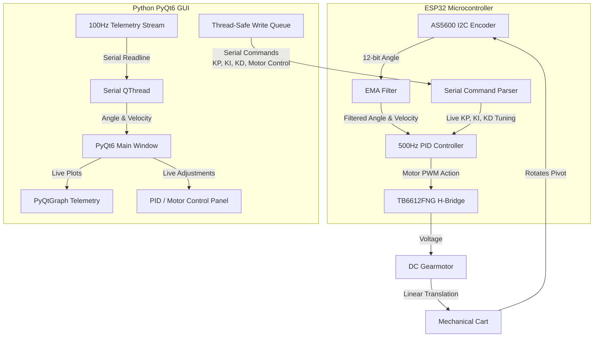

# Inverted Pendulum: Real-Time Hardware-in-the-Loop (HIL) Control & Reinforcement Learning Platform

An advanced, high-precision Hardware-in-the-Loop (HIL) inverted pendulum platform. This project integrates custom 3D-designed mechanical hardware, ESP32 firmware running a strict 500 Hz deterministic control loop, and a real-time PyQt6/PyQtGraph dashboard. 

The system is designed both for classical control (PID) and as a **demonstration platform for Reinforcement Learning (RL)**, featuring live telemetry visualization, real-time gain tuning, and thread-safe serial communication.

---

## 🛠️ System Architecture



---

## 🧠 Reinforcement Learning (RL) Framework

While the system comes with a highly tuned classical PID controller, it is fundamentally architected to act as a **Hardware-in-the-Loop (HIL) Reinforcement Learning Environment**, bridging physical hardware with Python-based learning libraries (such as `Gymnasium` and `Stable-Baselines3`).

### 1. Markov Decision Process (MDP) Definition
For RL training, the physical cart-pole setup is treated as an environment where the agent interacts in discrete time steps:

*   **State Space ($S$):** A continuous vector containing the physical states:
    $$s_t = [x, \dot{x}, \theta, \dot{\theta}]$$
    *   $x$: Position of the cart along the rail (currently unmeasured; placeholder in model).
    *   $\dot{x}$: Linear velocity of the cart.
    *   $\theta$: Angular deviation of the pendulum from vertical (upright $180^\circ$ is defined as $0$).
    *   $\dot{\theta}$: Angular velocity of the pendulum (filtered using the low-pass EMA filter).

*   **Action Space ($A$):** 
    *   **Continuous Control:** PWM voltage command sent to the motor driver in the range $[-255, 255]$.
    *   **Discrete Control:** Left push, Right push, or Idle: $a_t \in \{-\text{PWM\_speed}, 0, +\text{PWM\_speed}\}$.

*   **Reward Function ($R$):** The agent is rewarded for maintaining balance while minimizing control effort and movement:
    $$R_t = - \left( \theta_t^2 + 0.1 \cdot \dot{\theta}_t^2 + 0.01 \cdot u_t^2 \right)$$
    where $u_t$ is the control voltage (PWM duty cycle) applied at step $t$.

### 2. HIL Training Loop Interface
The Python dashboard serves as the environment wrapper. 
1. The **ESP32** sends high-frequency state updates ($s_t$) via the 100 Hz serial telemetry stream.
2. The **Python Environment** decodes the serial stream and passes the state to the RL Agent (e.g., Deep Q-Network or PPO).
3. The **RL Agent** computes the optimal action $a_t$ based on its policy.
4. The Python thread uses the thread-safe **Serial Command Queue** to transmit the action to the ESP32 (e.g., `F` for forward, `B` for backward, or raw speed `P,val`).
5. The **ESP32** applies the motor voltage immediately, updating the physical environment to state $s_{t+1}$.

---

## 🔌 Hardware Setup & Wiring

### Bill of Materials (BOM)
*   **Microcontroller:** ESP32 (Dual Core, 240MHz)
*   **Sensor:** AS5600 Magnetic Encoder (12-bit resolution, I2C interface)
*   **Motor Driver:** TB6612FNG Dual H-Bridge Motor Driver
*   **Motor:** 6V–12V DC Gearmotor
*   **Chassis:** 3D printed mechanical cart and track rails (CAD files provided in `Models/`)

### Wiring Diagram

```
    ESP32                     TB6612FNG                  MOTOR
    ─────                     ─────────                  ─────
    3.3V  ───────────────────► VCC (Logic Power)
    GND   ───────────────────► GND ◄─── Battery GND
                               VM  ◄─── Battery Power (6-12V)

    GPIO 25 ─────────────────► AIN1 (Direction 1)
    GPIO 26 ─────────────────► AIN2 (Direction 2)
    GPIO 27 ─────────────────► PWMA (Speed Control)
    GPIO 33 ─────────────────► STBY (Standby - HIGH active)

                               AO1 ────────────────────► Motor Terminal A
                               AO2 ────────────────────► Motor Terminal B


    (AS5600 Angle Encoder Connection)
    GPIO 21 (SDA) ───────────► SDA (AS5600)
    GPIO 22 (SCL) ───────────► SCL (AS5600)
```

> [!WARNING]
> Do NOT connect the motor power supply (**VM**) to the ESP32's **3.3V** pin. This will permanently damage the microcontroller. Ensure all grounds (GND) are tied together.

---

## 💾 Firmware Details (`Firmware/angle_encoder`)

The firmware contains several optimizations to ensure high-speed control loop stability:

*   **Deterministic 500 Hz Execution:** Telemetry logging over serial is extremely slow and blocks execution. The PID loop is decoupled from logging, running on a strict 2ms interval (`micros()`) while telemetry is throttled to 100 Hz.
*   **Exponential Moving Average (EMA) Filter:** Filters high-frequency noise from the AS5600 magnetic encoder before computing the derivative term, preventing violent motor jitter.
    $$\text{filtered\_derivative} = \alpha \cdot \text{raw\_derivative} + (1 - \alpha) \cdot \text{previous\_derivative}$$
*   **Dynamic Crossing Inversion:** The physical behavior flips at the horizontal X-axis (90° and 270°). Below the horizontal, it acts as a stable pendulum (needs opposite acceleration to swing up). Above the horizontal, it acts as an unstable inverted pendulum (needs same-direction acceleration to catch). The firmware automatically flips control signs dynamically.
*   **Linear Deadband Compensation:** Overcomes the static friction of the DC gearmotor by starting at a minimum torque of 50/255 and scaling linearly to 255.

---

## 🖥️ Graphical User Interface (`Scripts/index.py`)

The control dashboard provides real-time interaction:

*   **PyQtGraph Telemetry Plots:** Real-time, low-latency scrolling charts plotting angular deviation and angular velocity vs. time.
*   **Live Parameter Tuning:** Exposes spinboxes to tune $K_P$, $K_I$, and $K_D$ constants live over Serial without flashing the ESP32.
*   **Thread-Safe Writes:** Incorporates an asynchronous writing Queue to prevent PySerial write calls from blocking the main PyQt GUI event loop.
*   **Manual Keyboard Control:** Allows manual cart override using the `a` (left) and `d` (right) keys.

---

## 🚀 Getting Started

### 1. Installation
Ensure you have Python 3.10+ installed. Install the required libraries:
```bash
pip install PyQt6 pyqtgraph pyserial numpy
```

### 2. Flashing the Firmware
1. Open the Arduino IDE.
2. Install the `AS5600` library via the Library Manager.
3. Open `Firmware/angle_encoder/angle_encoder.ino`.
4. Connect the ESP32 via USB and upload the sketch.
   *   *Note: Ensure the pendulum hangs completely still during the first 3 seconds of bootup to calibrate the vertical axis.*

### 3. Launching the Dashboard
Start the Python dashboard:
```bash
python Scripts/index.py
```
*   Select your active COM port (detected automatically).
*   Use the **START** button to verify motor oscillation.
*   Adjust $K_P$, $K_I$, and $K_D$ settings.
*   Click **Start Auto-Balance**, manually raise the pendulum to vertical, and let the control loop stabilize it!
