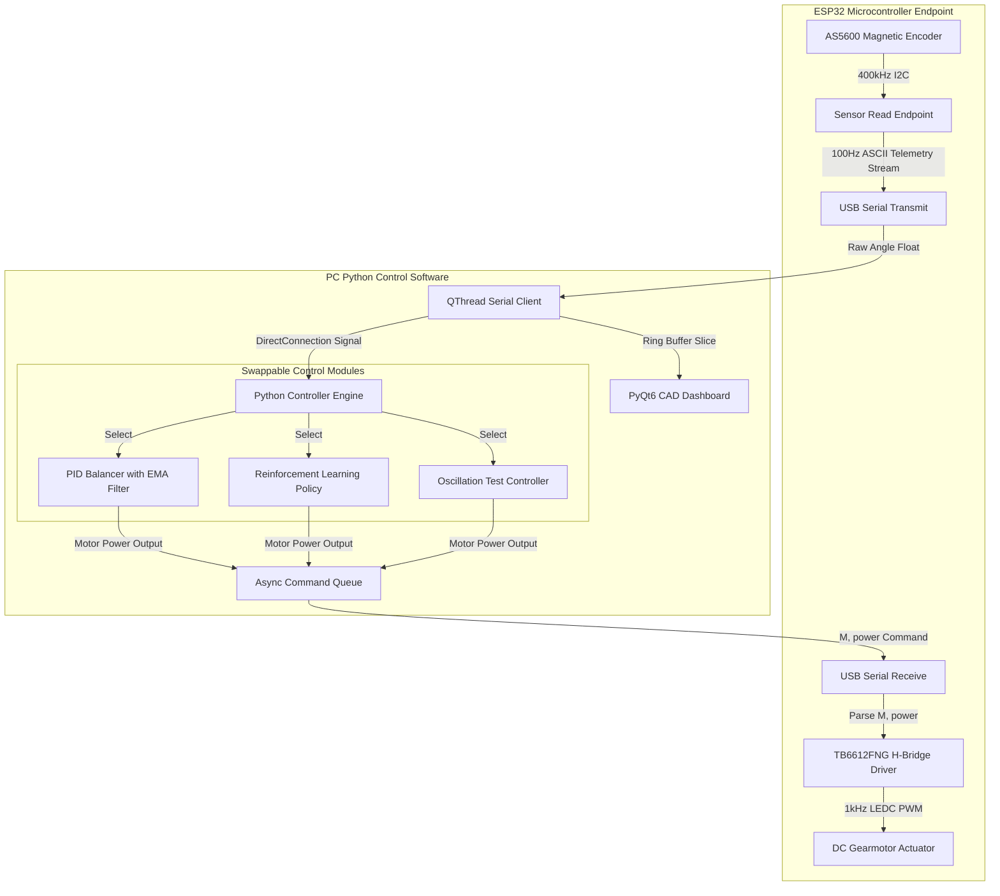

# Hardware-in-the-Loop (HIL) System Architecture

This document details the architectural migration of the **Inverted Pendulum Platform** from embedded microcontroller balancing to a high-speed **Python-Hosted Hardware-in-the-Loop (HIL)** control paradigm.

---

## 🏛️ Architectural Evolution

### Why Move Balancing Logic to Python?
In traditional embedded robotics, closed-loop PID algorithms are compiled directly into microcontroller C++ firmware. While deterministic, this approach presents significant bottlenecks for modern research and advanced AI control:
1. **Zero Recompile Friction:** Tuning parameters, modifying non-linear filters, or experimenting with novel control algorithms no longer requires compiling and flashing firmware over USB.
2. **Reinforcement Learning (RL) Native:** Deep Reinforcement Learning agents (e.g., PPO, SAC, DQN via PyTorch, Stable-Baselines3, or Gymnasium) execute within a Python runtime. By turning the ESP32 into an ultra-fast I/O endpoint, physical hardware is directly exposed as an OpenAI Gym / Gymnasium environment without complex bridging layers.
3. **Advanced Telemetry & Diagnostics:** Running the controller on the PC host allows microsecond-precise logging, real-time FFT frequency analysis, and phase-portrait visualization in PyQtGraph without saturating microcontroller memory or serial buffers.

---

## 🔗 System Dataflow & HIL Loop

---

## 🧠 Python Control Algorithms

The host software implements a modular controller architecture where controllers inherit from `BaseController`.

### 1. PID Balancer with Noise Suppression (`PIDBalancer`)
To maintain upright stability without mechanical limit-cycle buzzing or quantization jitter, the Python PID controller implements four essential optimizations:

*   **Exponential Moving Average (EMA) Derivative Filter:**
    The 12-bit magnetic encoder produces quantization noise that causes massive spikes when taking raw numerical derivatives ($\frac{\Delta e}{\Delta t}$). We apply a first-order low-pass EMA filter:
    $$\text{filtered\_derivative}_t = \alpha \cdot \frac{e_t - e_{t-1}}{\Delta t} + (1 - \alpha) \cdot \text{filtered\_derivative}_{t-1}$$
    With $\alpha = 0.08$ at $100\text{ Hz}$, the filter cutoff frequency is $\approx 6.4\text{ Hz}$, completely dampening sensor jitter while preserving phase margin.

*   **Dynamic Crossing Inversion:**
    The physical dynamics of a pendulum invert across the horizontal plane ($90^\circ$ and $270^\circ$). Below horizontal, the system is stable and requires opposing torque to dampen swings. Above horizontal, the system is unstable and requires same-direction acceleration to catch the falling center of mass. The controller dynamically checks:
    $$\text{above\_horizontal} = (90^\circ < \theta < 270^\circ)$$
    If true, the control output sign is inverted automatically.

*   **Linear Deadband Compensation:**
    DC gearmotors exhibit static friction (stiction). Sending PWM voltages below a threshold (e.g., duty cycle $< 45$) produces zero physical torque, creating a deadzone where balance is lost. The controller maps control output linearly from the minimum actuation power ($45$) up to maximum power ($255$).

*   **Equilibrium Deadzone Coasting:**
    When the pendulum is within $\pm0.4^\circ$ of vertical and angular velocity is below $6.0^\circ/\text{s}$, the controller commands coasting (`0` power). This prevents the motor from continuously buzzing back and forth across the encoder's least significant bit (LSB).

---

## 🤖 Reinforcement Learning MDP Formulation

For hardware-in-the-loop RL training, the physical setup is modeled as a continuous Markov Decision Process (MDP):

*   **State Space ($\mathcal{S}$):** Continuous vector $s_t = [\theta, \dot{\theta}]$ (or $[x, \dot{x}, \theta, \dot{\theta}]$ when cart encoder is installed).
*   **Action Space ($\mathcal{A}$):** Continuous motor voltage command $a_t \in [-255, 255]$ sent via `M,<power>` endpoint.
*   **Reward Function ($\mathcal{R}$):**
    $$R_t = - \left( (\theta_t - 180^\circ)^2 + 0.1 \cdot \dot{\theta}_t^2 + 0.001 \cdot a_t^2 \right)$$
    Reward is maximized when angular deviation and velocity are zero with minimal control energy expenditure.
